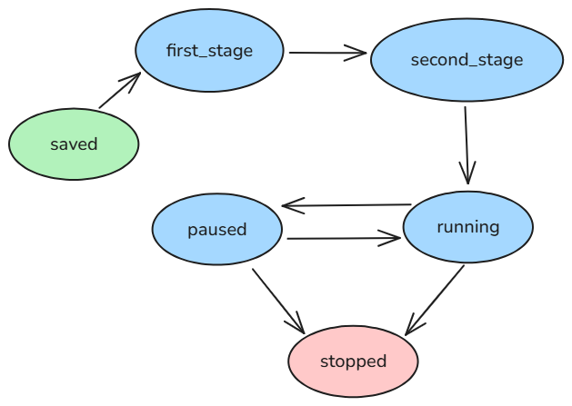

# Simulator einer Feuerwerkssteuerung

Der Simulator wurde mit dem [FastAPI-Framework](https://fastapi.tiangolo.com/) umgesetzt.
Es wird die HTTP-Schnittstelle der Feuerwerkssteuerung simuliert.

## Installation von FastAPI

FastAPI kann mit dem folgenden Kommandozeilenbefehl installiert werden:

``
pip install fastapi[standard]
``

## Starten

Nach der Installation kann der Simulator mit dem folgenden Kommandozeilenbefehl gestartet werden:

``
fastapi run ./app.py
``

Anschließend ist die API unter http://127.0.0.1:8000/ erreichbar.
Die Dokumentation der Endpunkte ist unter http://127.0.0.1:8000/docs erreichbar.

## Funktionsweise

Der Simulator speichert zur Laufzeit Feuerwerk-Sequenzen.
Eine Feuerwerk-Sequenz hat einen Namen und einen der folgenden Status:

| Status       | Beschreibung                               |
|--------------|--------------------------------------------|
| saved        | Sequenz ist gespeichert.                   |
| first_stage  | Sequenz wurde zum ersten Mal freigegeben.  |
| second_stage | Sequenz wurde zum zweiten Mal freigegeben. |
| running      | Sequenz läuft.                             |
| paused       | Sequenz ist pausiert.                      |
| stopped      | Sequenz wurde gestoppt.                    |

Die Status 'first_stage', 'second_stage', 'running' und 'paused' können jeweils nur von einer Sequenz gleichzeitig
belegt sein.

### Zustandsdiagramm

